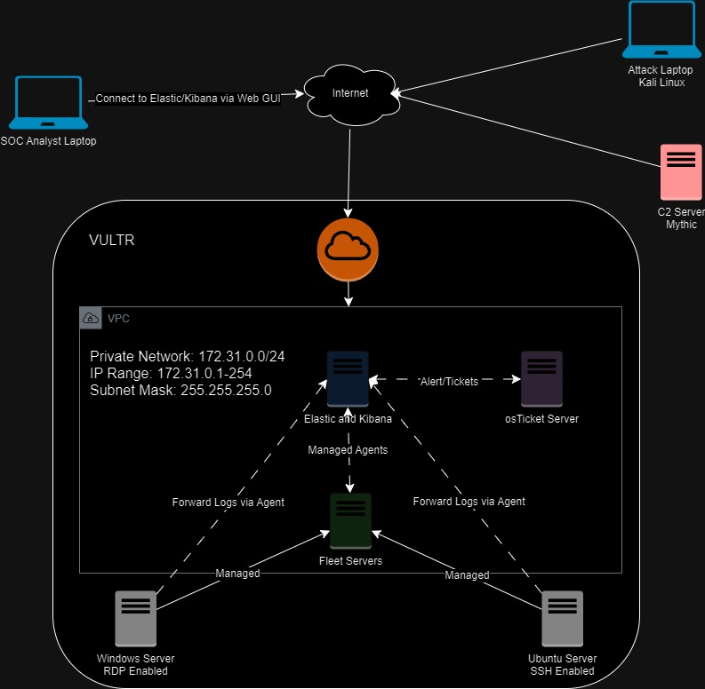
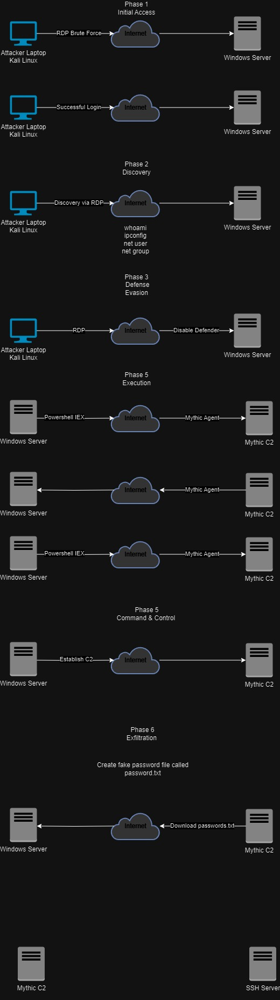

# ELK SOC Lab Setup and Configuration – 01/10/2024

In this lab, I set up an ELK stack (Elasticsearch, Logstash, Kibana) SOC on Vultr to simulate the implementation and configuration of a Security Information and Event Management (SIEM) system within a Virtual Private Cloud (VPC). The project included configuring various systems, simulating a brute force attack using Mythic C2, and creating custom dashboards for alerting and monitoring security events. Below is a detailed step-by-step breakdown of the lab configuration.

This is the Lab logical diagram:

## 1. VPC and Elasticsearch Server Configuration:
### VPC Setup:
- Created a VPC 2.0 network on Vultr in the Sydney region with the network address `172.31.0.0/24`.

### Elasticsearch Installation:
- Deployed an Ubuntu 22.04 LTS VM named `ELK-SOCLab` with 80GB storage.
- Downloaded the Elasticsearch DEB package using `wget` and installed it on the VM.
- Modified the Elasticsearch configuration (`/etc/elasticsearch/elasticsearch.yml`) to change the `localhost` to the public IP address of the VM and enabled the HTTP port.
- Configured firewall rules in Vultr to only allow access from my IP address.

### Kibana Installation:
- Installed Kibana and configured it by editing `/etc/kibana/kibana.yml`, setting the server port and binding it to the public IP address of the VM.
- Allowed Kibana traffic on port 5601 using `ufw` and set up firewall rules in Vultr to limit access to my IP.
- Connected to Kibana via the public IP (`http://[VM public IP]:5601`), used the Elasticsearch enrollment token, and set up encryption keys for Kibana security.

## 2. Windows Client Configuration:
- Deployed a Windows Server VM on Vultr in the Sydney region, choosing the shared CPU option and the Windows Standard Image.
- Disabled auto-backups and IPv6.
- Accessed the Windows Server using the Vultr console and installed **Sysmon** (System Monitor) to enhance logging capabilities.
- Integrated the Windows Server with the ELK stack by adding Sysmon logs through the Elastic Agent, using the Windows Event Logs integration for deeper visibility into Windows events.

## 3. Fleet Server Configuration:
### Fleet Server Setup:
- Deployed another Ubuntu 22.04 VM named `ELKSOCLab-FleetServer` and installed the Elastic Agent on it, designating it as a Fleet Server.
- Created a Fleet Server Policy within Elastic and attached the server to this policy.

### Agent Deployment:
- Created a new Fleet Windows Policy (`ELK-SOCLAB-omar`) for Windows log collection and deployed the Elastic Agent on the Windows Server, allowing for real-time log ingestion.

## 4. Data Ingestion and Custom Integrations:
### Windows Data Ingestion:
- Added custom Windows Event Logs in Elasticsearch, including Sysmon and Microsoft Defender logs, to provide more visibility into system activities and security events.
- Created two integration policies: `SOCLAB-WIN-Defender` for Microsoft Defender logs and `SOCLAB-WIN-SYSMON` for Sysmon logs.

### Ubuntu Server Configuration:
- Deployed an additional Ubuntu VM named `ELKSOCLAB-Linux-Omar`, installed the Elastic Agent, and added it to the Fleet Server to ingest Linux logs into Elasticsearch for further analysis.

## 5. Custom Dashboards:
### Dashboard 1:
- Monitored failed and successful authentication attempts for SSH and RDP with the following visualizations:
  - SSH Failed/Successful Authentication Maps
  - SSH Failed/Successful Activity Tables
  - RDP Failed/Successful Authentication Maps
  - RDP Failed/Successful Activity Tables

### Dashboard 2:
- Focused on process and network activity, including:
  - Process Created Table (to track newly created processes)
  - Process Initiated Network Table (to monitor network connections made by processes)
  - Microsoft Defender Disabled Table (to detect if Windows Defender was disabled)

## 6. Mythic C2 Server and Agent Setup:
### Mythic Server Deployment:
- Deployed a new Ubuntu VM on Vultr named `ELKSOCLab-Mythic` and installed Mythic C2 using Docker.

This is the Attack diagram:

### Mythic Agent Configuration:
- Created an **Apollo Mythic agent** with an HTTP profile, enabling all commands. The agent was configured to call back to the Mythic Server, simulating a compromised Windows system.
- Named the agent `svchost.exe` to blend in with legitimate processes on the target system.

## 7. Brute Force Attack Simulation:
### Kali Linux Setup:
- Installed Kali Linux on VirtualBox, updated the repositories, and prepared it for the attack.
- Used **Crowbar** to perform a brute force attack on the Windows Server by leveraging weak passwords.
- After gaining access, disabled Windows Defender and executed a Python HTTP server to deliver the C2 Mythic agent to the compromised Windows system.
- Successfully established a connection between the Mythic agent and the Mythic Server, simulating command and control operations.

## 8. osTicket Setup and Integration:
### osTicket Installation:
- Deployed a new Windows Server on Vultr (IP: `172.31.0.5`) for osTicket.
- Installed XAMPP with PHP 8.2.12 and configured it to work with osTicket.
- Set up the osTicket web interface, creating a database for ticket management.
- Configured the necessary firewall rules in Windows Defender to allow incoming traffic on ports 80 and 443.

### osTicket and ELK Integration:
- Created an API key on the osTicket server and integrated it with ELK using a webhook for secure communication.
- Used this setup to automatically generate tickets in osTicket based on security alerts triggered in the ELK stack.

