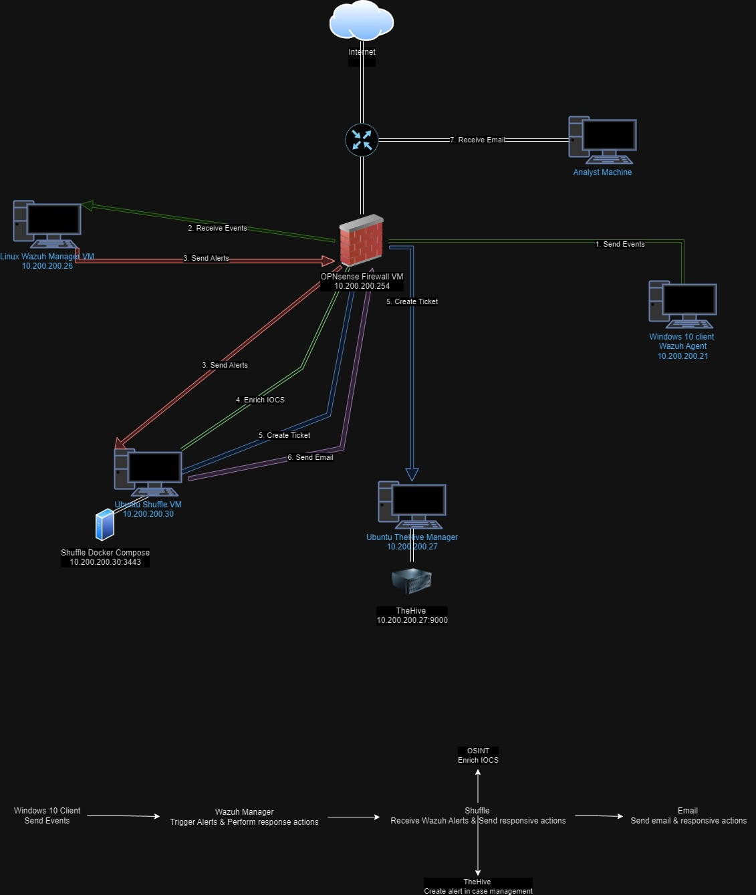

### Wazuh SOC Lab

The objective of this lab is  to configure a secure SOC environment behind a firewall and to automate alert and ticket generation through the use of open-source Security tools.

This is the Lab logical diagram diagram:

To make this work I had a list of tools I had to use.

OPNsense Firewall
Wazuh SIEM and XDR
TheHive ticketing systen
Shuffle SOAR

I used Oracle VirtualBox to host my VMs. The idea is that I wanted to host everything on my computer to learn how all the configurations are done step by step all by myself.

## OPNsense Firewall VM

I setup the firewall in a way to put all of my hosted VMs in a LAN network and connect it to the internet through the WAN interface.

The firewall will have all traffic routed from the other VMs through it to to the internet.

## Wazuh Manager VM

The Wazuh manager will collect the logs from the Windows 10 machine to create alerts and send it to Shuffle to automate the ticket generation.

## Windows 10 Host

I installed Sysmon and the Wazuh agent to collect logs and send them back to Wazuh Manager.

This machine will be the target of a simulated attack so that we can create a simulated alert and ticket using the Shuffle workflow.

## TheHive VM

TheHive will simulate a ticket being created once an alert is triggered from Wazuh.

## Shuffle VM

Installed a docker Shuffle image that can be accessed using a web GUI

## How it all works

As you saw earlier in the logical diagram, the purpose of this lab is to learn how to automate workflows in a SOC environment.

We start by simulating an attack on the Windows 10 Client machine that will be detected by the Wazuh Agent installed on it.

That will then get sent to the Wazuh Manager that will then generate an alert we created using a custome rule.

It will then send that alert to Shuffle. Shuffle will Enrich IOCs using a VirusTotal API.

Shuffle will then create a ticket in TheHive and send an email with all the relevant information and with the enriched IOCs to the Analyst.

The Analyst will then recieve the email and can log on TheHive and Wazuh to take the ticket and further investigate the incident.

